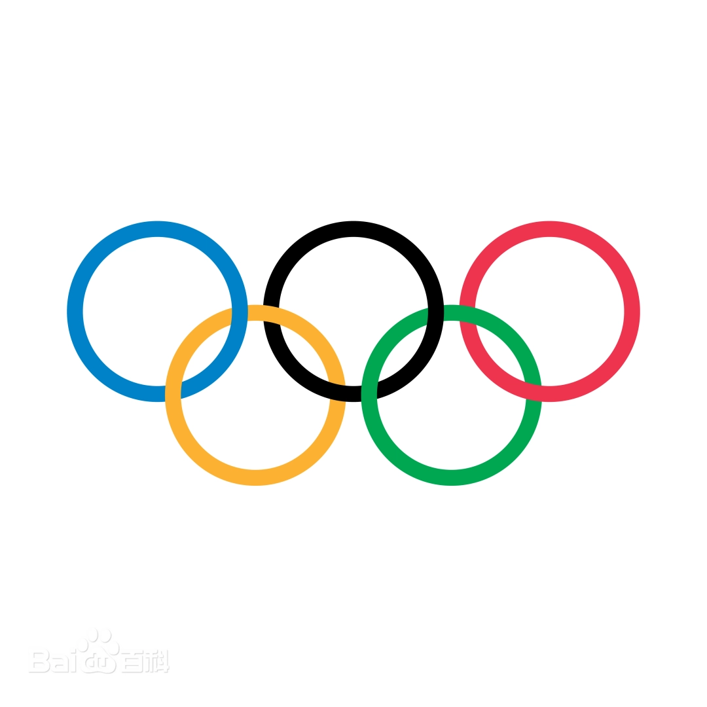

# Canvas 绘制奥运五环教程

这是一份面向前端初学者的 Canvas 实战教程。目标不是只把五个圆画出来，而是借“奥运五环”这个图案，理解 Canvas 画布尺寸、圆弧绘制、描边宽度、比例计算、交错覆盖、类封装和实时控制面板这些常见前端知识点。

示例文件：

- `canvas-olympic-rings.html`
- `奥运五环标准图片.webp`

在线访问奥运五环效果：[点我](https://dhclly.github.io/canvas-olympic-rings/)

## 1. 奥运五环是什么



奥运五环是奥林匹克运动最核心的视觉标志之一，由现代奥林匹克运动创始人皮埃尔·德·顾拜旦在 1913 年构思。标志在 1914 年巴黎奥林匹克代表大会上首次展示，后来在 1920 年安特卫普奥运会上正式出现在奥运赛场。

五环由五个尺寸相同、互相交错的圆环组成。上排从左到右是蓝、黑、红，下排是黄、绿。常用配色为：

```js
blue: "#0085C7"
black: "#000000"
red: "#DF0024"
yellow: "#F4C300"
green: "#009F3D"
```

需要注意一个常见误区：五种颜色并不是分别对应五大洲。顾拜旦选择五环颜色加白色背景，是因为这些颜色组合能够覆盖当时世界各国国旗中出现的颜色，表达奥林匹克运动的普遍性和包容性。

## 2. Canvas 基础：画布尺寸不要只靠 CSS

Canvas 有两个尺寸概念：

- `canvas.width` / `canvas.height`：画布内部真实像素尺寸，也就是绘图缓冲区大小。
- CSS `width` / `height`：画布在页面上的显示尺寸。

如果只用 CSS 设置尺寸，而不设置 `canvas.width` 和 `canvas.height`，浏览器会把默认 `300 x 150` 的画布拉伸到 CSS 尺寸，圆可能变成椭圆，线条也会发虚。

本项目采用 JS 自动计算画布真实尺寸：

```js
olympicRings.resizeCanvas(canvas).draw(canvas);
```

这样可以保证画布大小刚好容纳五环，并且左右、上下保留一致的偏移量。

## 3. 用 arc 画圆环时，radius 不是内圈半径

Canvas 画圆环通常不是画两个圆，而是画一条有宽度的圆形描边：

```js
ctx.lineWidth = 20;
ctx.arc(x, y, radius, 0, Math.PI * 2);
ctx.stroke();
```

这里的 `radius` 是描边线条的中心线半径。线宽会向内、向外各扩展一半。

例如：

```js
radius = 40;
lineWidth = 6;
```

实际得到：

```txt
内圈半径 = 40 - 6 / 2 = 37
外圈半径 = 40 + 6 / 2 = 43
```

所以本项目反过来设计：先定义内圈半径和外圈比例，再计算 Canvas 真正需要的中心线半径和线宽。

```js
get lineRadius() {
  return (this.innerRadius + this.outerRadius) / 2;
}

get lineWidth() {
  return this.outerRadius - this.innerRadius;
}
```

这能让“内圈半径为 1，外圈半径为 1.2”这类比例更容易表达。

## 4. 推荐的五环比例

官方规范更强调“等尺寸、紧密交错、标准排列”，并不要求前端代码必须使用某个固定像素值。为了方便绘制，本项目使用一组相对比例：

```txt
内圈半径：1
外圈半径：1.2
相邻圆环圆心水平距离：2.6
上下两排圆心垂直距离：1.1
```

换成代码就是：

```js
innerRadiusRatio: 1,
outerRadiusRatio: 1.2,
horizontalGapRatio: 2.6,
verticalGapRatio: 1.1,
```

如果 `innerRadius = 100`，那么：

```txt
内圈半径 = 100
外圈半径 = 120
中心线半径 = 110
线宽 = 20
水平圆心距 = 260
垂直圆心距 = 110
```

## 5. 五个环的位置如何计算

以左上偏移量 `x`、`y` 为起点，先计算上排第一个环的圆心：

```js
const startX = this.options.x + this.outerRadius;
const startY = this.options.y + this.outerRadius;
```

因为 `x` 和 `y` 表示图案外边界到画布边缘的留白，而圆心还要向右、向下移动一个外圈半径。

五个环的位置：

```js
return [
  this.createRing("blue", startX, startY),
  this.createRing("black", startX + this.horizontalGap, startY),
  this.createRing("red", startX + this.horizontalGap * 2, startY),
  this.createRing("yellow", startX + this.horizontalGap / 2, startY + this.verticalGap),
  this.createRing("green", startX + this.horizontalGap * 1.5, startY + this.verticalGap),
];
```

下排的黄环和绿环分别位于上排两个间隔的中间，所以 X 坐标会多出半个水平间距。

## 6. 自动调整画布尺寸

画布需要刚好装下所有圆环。宽度和高度分别计算：

```js
const maxCenterX = Math.max(...rings.map((ring) => ring.x));
const maxCenterY = Math.max(...rings.map((ring) => ring.y));

canvas.width = Math.ceil(maxCenterX + this.outerRadius + this.options.x);
canvas.height = Math.ceil(maxCenterY + this.outerRadius + this.options.y);
```

注意：最大的 X 和最大的 Y 不一定来自同一个圆。宽度只关心最靠右的圆心，高度只关心最靠下的圆心。

## 7. 为什么要处理覆盖关系

如果只是按顺序画五个完整圆环：

```js
blue -> black -> red -> yellow -> green
```

后画的环会完整盖住先画的环。这样虽然有交叠，但不是标准五环那种“互相穿插”的效果。

五环视觉上需要在部分交点处反过来覆盖。当前实现思路是：

1. 先按顺序画完整五个环。
2. 下排的黄、绿因为后画，默认已经盖住上排环。
3. 再补画 4 段上排环的小弧线，让部分交点看起来像上排环压在下排环上。

当前规则：

```js
[
  { upperRingName: "blue", lowerRingName: "yellow", pointPosition: "upper" },
  { upperRingName: "black", lowerRingName: "yellow", pointPosition: "lower" },
  { upperRingName: "black", lowerRingName: "green", pointPosition: "upper" },
  { upperRingName: "red", lowerRingName: "green", pointPosition: "lower" },
]
```

这里的 `upperRingName` 不是指位置在上排，而是指“这一小段需要盖在上面”的环。

## 8. 固定角度 vs 动态计算交点

最简单的覆盖实现，是直接写死几段角度：

```js
ctx.arc(x, y, radius, Math.PI * 1.9, Math.PI * 2.1);
```

优点是直观，缺点是比例、半径、间距一变，角度就可能不准。

本项目后来改成动态计算交点：

```js
const dx = otherRing.x - ring.x;
const dy = otherRing.y - ring.y;
const distance = Math.hypot(dx, dy);
const baseAngle = Math.atan2(dy, dx);
const offsetAngle = Math.acos(distance / (2 * radius));
```

含义如下：

- `distance`：两个圆心之间的距离。
- `baseAngle`：从第一个圆心看向第二个圆心的方向。
- `offsetAngle`：交点相对圆心连线偏出去的角度。

两个圆的两个交点角度：

```js
baseAngle + offsetAngle
baseAngle - offsetAngle
```

再根据 `pointPosition: "upper"` 或 `"lower"` 选择更靠上的交点或更靠下的交点。

这个方案的优点是尺寸变化时能自动适配；缺点是代码复杂，并且“谁压谁”仍然需要规则表指定，不能只靠几何自动推出来。

## 9. 补画弧线多长合适

补画弧线不能太长，否则会延伸到相邻交点，出现颜色“穿透”的错觉。当前项目使用线宽和中心线半径计算一个短弧范围：

```js
const anglePadding = (this.lineWidth / this.lineRadius / 2) * 1.60;
```

理解方式：

- `this.lineWidth / this.lineRadius`：一整条线宽大致对应的弧度。
- `/ 2`：左右两边各补半个线宽。
- `* 1.60`：增加一点余量，避免交点边缘露出下面的颜色。

另外，补画短弧时使用：

```js
lineCap = "butt"
```

如果使用 `round`，端点会额外长出半个线宽的圆帽，视觉长度会变长。调试时可以开启 `debugInterlacedColor`，给补画弧线单独上色，方便观察覆盖范围。

## 10. 类封装：OlympicRings

项目把绘制逻辑封装成了 `OlympicRings` 类：

```js
const olympicRings = new OlympicRings({
  x: 25,
  y: 25,
  innerRadius: 100,
});

olympicRings.resizeCanvas(canvas).draw(canvas);
```

主要能力：

- 根据比例计算五个环的参数。
- 根据圆环大小自动调整画布。
- 绘制完整五环。
- 设置单个圆环颜色。
- 批量设置颜色。
- 设置所有圆环为同一种颜色。
- 设置背景色。
- 设置补画弧线调试颜色。

示例：

```js
olympicRings
  .setAllRingColor("#0085C7")
  .setBackgroundColor("#f7f7f7")
  .resizeCanvas(canvas)
  .draw(canvas);
```

## 11. 右侧控制面板

页面右侧新增了一个浮动控制面板，支持实时修改：

- `x`
- `y`
- `innerRadius`
- `innerRadiusRatio`
- `outerRadiusRatio`
- `horizontalGapRatio`
- `verticalGapRatio`
- 背景色
- 五个环的颜色
- 统一环颜色
- 补画调试颜色

控制面板使用浏览器原生表单组件：

- `input[type="range"]`
- `input[type="number"]`
- `input[type="color"]`
- `input[type="checkbox"]`
- `button`

滑块拖动时使用 `requestAnimationFrame` 合并重绘：

```js
const scheduleRender = () => {
  if (renderFrameId !== null) {
    return;
  }

  renderFrameId = requestAnimationFrame(render);
};
```

这样做的原因是：滑块拖动会连续触发很多 `input` 事件，如果每次都立刻重绘，浏览器可能在一帧内重复绘制多次。`requestAnimationFrame` 可以把多次输入合并到下一帧，只执行一次真正的 `render()`。

## 12. 开发记录梳理

从 git 记录看，这个示例是逐步演进出来的：

```txt
v0.9.0   绘制五个环
v1.0.0   给圆环和补画弧线增加详细注释
v1.0.1   添加奥运五环标准图片
v2.0.0   更新 README
v3.0.0   抽取为 OlympicRings 类
v3.8.0   调整关键代码
v4.0.0   改为动态计算覆盖弧度
后续      增加 debug、控制面板、默认值和样式修正
```

这也是一个适合初学者的学习路径：

1. 先学会用 `arc()` 画一个圆。
2. 再画五个不同颜色的圆。
3. 理解 `lineWidth` 和 `radius` 的真实关系。
4. 把硬编码坐标改为比例计算。
5. 把过程式代码封装成类。
6. 处理环与环之间的覆盖关系。
7. 增加控制面板，把静态绘图变成可交互工具。

## 13. 常见坑

### 忘记 beginPath

每画一个独立圆环前都应该调用：

```js
ctx.beginPath();
```

否则多个圆会被追加到同一条路径里，颜色和线条可能互相影响。

### 只改 canvas CSS 尺寸

只改 CSS 会拉伸画布。绘图分辨率要通过：

```js
canvas.width = width;
canvas.height = height;
```

设置。

### 修改 canvas.width 会清空画布

只要重新设置 `canvas.width` 或 `canvas.height`，画布内容就会被清空，所以调整尺寸后必须重新绘制。

### 覆盖弧线太长

补画弧线如果太长，会延伸到别的交点，导致颜色看起来穿透。可以开启：

```js
debugInterlacedColor: "pink"
```

观察补画弧线实际覆盖范围。

### lineCap 会影响短弧长度

`round` 会在端点额外画半圆帽，短弧看起来会更长。`butt` 更容易精确控制补画长度。

## 14. 如何运行

直接用浏览器打开：

```txt
canvas-olympic-rings.html
```

这是一个纯 HTML + CSS + JavaScript 示例，不需要构建工具，也不需要启动开发服务器。

## 15. 小结

这个项目虽然只是画一个奥运五环，但覆盖了很多前端基础能力：

- Canvas 真实尺寸和显示尺寸的区别
- `arc()`、`stroke()`、`beginPath()` 的使用
- 描边线宽和圆环内外半径的关系
- 用比例代替硬编码坐标
- 类封装和链式 API
- 几何交点计算
- 局部补画实现覆盖效果
- 原生表单控制 Canvas 实时重绘

如果你是前端初学者，建议不要一开始就追求最终版本。先从“画五个圆”开始，再一步步加比例、类、覆盖和控制面板。这样每一步都能对应到一个明确的 Canvas 知识点。
